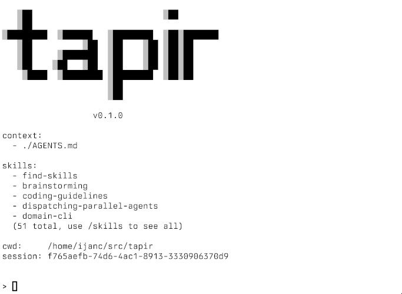

# tapir

An AI agent coding.

  

> The [tapir](https://en.wikipedia.org/wiki/Tapir) is a resilient, ancient
> mammal native to South America and Southeast Asia — quiet, sturdy, and built
> to navigate dense terrain. Much like its namesake, this project is designed to
> reliably orchestrate AI agents through complex environments.

## Links

- [Website](https://tapir.dev)
- [Source code](https://git.sr.ht/~ijanc/tapir) (primary)
- [GitHub mirror](https://github.com/ijanc/tapir)

## License

ISC — see [LICENSE](LICENSE).
